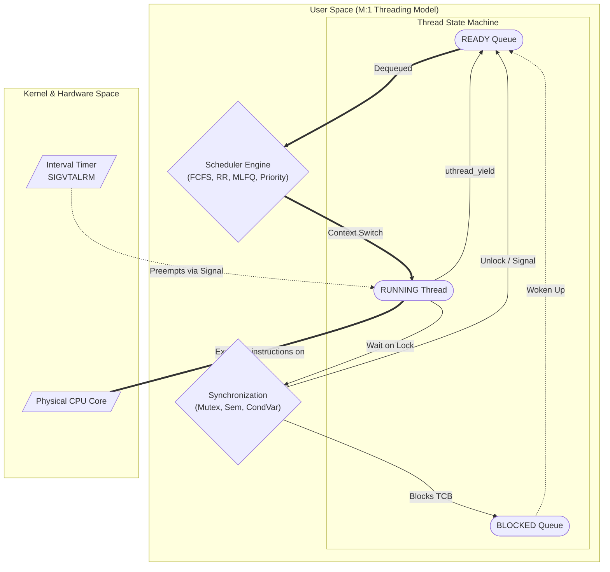

# uthread-lib

`uthread-lib` is a high-performance, POSIX-compliant user-level threading library engineered in C from the ground up. It implements lightweight green threads, context switching, timer-based preemptive scheduling, and atomic-backed synchronization primitives entirely independent of `pthreads` or other third-party abstractions.

This library serves as a robust demonstration of operating system internals and concurrent systems design, offering microsecond-level context switching and supporting workloads of tens of thousands of concurrent threads efficiently.

## System Architecture

The library maps $M$ user-space green threads onto a single kernel thread ($M:1$ threading model). The core execution flow, preemption subsystem, and synchronization barriers are architected as follows:



### Repository Structure

```text
.
├── Makefile                     # Build system with strict C11 configuration
├── README.md                    # Core project documentation
├── benchmarks/                  # Performance benchmarks
│   ├── bench_context_switch.c   # Measures raw context switch latency
│   └── bench_scheduler_throughput.c # Measures scheduler dispatch rate
├── docs/                        # Architectural specifications
│   ├── design.md                # TCB layout & context switch flow details
│   └── scheduler_comparison.md  # Detailed scheduler benchmarks
├── include/                     # Public library headers
│   ├── uthread.h                # Thread lifecycle API & TCB definition
│   ├── uthread_mutex.h          # Mutex, Sem, and CondVar signatures
│   └── uthread_sched.h          # Scheduler pluggable interface
├── scripts/
│   └── run_all_tests.sh         # CI validation script for all test configurations
├── src/                         # Library implementation
│   ├── context.c                # Wrapper around makecontext/swapcontext
│   ├── internal.h               # Shared internal state and signal macros
│   ├── stack.c                  # Stack allocation and memory barriers
│   ├── timer.c                  # Preemption logic and signal handlers
│   ├── uthread.c                # Thread lifecycle (create, yield, join, exit)
│   ├── schedulers/              # Pluggable scheduling implementations
│   │   ├── sched_fcfs.c
│   │   ├── sched_interface.c
│   │   ├── sched_mlfq.c
│   │   ├── sched_priority.c
│   │   └── sched_rr.c
│   └── sync/                    # Synchronization primitives
│       ├── condvar.c
│       ├── mutex.c
│       └── semaphore.c
└── tests/                       # Unit & stress tests
    ├── stress/                  # Scale and workload tests
    └── unit/                    # Behavior and regression tests
```

## Core Capabilities

- **Lightweight Green Threads**: Fast context switching powered by `ucontext.h`, allowing for millions of yields per second without kernel-mode transitions.
- **Preemptive Engine**: Robust time-slicing utilizing `setitimer` (`SIGVTALRM`), protected by meticulous signal masking to guarantee thread safety and prevent re-entrancy anomalies.
- **Pluggable Scheduling Architecture**: Supports interchangeable algorithms configurable at runtime:
  - First-Come-First-Served (FCFS)
  - Round Robin (RR)
  - Multi-Level Feedback Queue (MLFQ)
  - Priority-with-Aging
- **Non-Busy-Waiting Concurrency**: Implements `Mutexes`, `Condition Variables`, and counting `Semaphores`. These utilize foundational atomic compare-and-swap (`stdatomic.h`) Spinlocks merely to protect internal wait-queues, ensuring blocked threads gracefully yield the CPU instead of wasting cycles.

## Performance & Benchmark Results

The library was evaluated against native Linux kernel threads (`pthreads`) on an Intel/AMD x86_64 Linux environment (2,000,000 context switches and 500,000 yields).

### 1. Context Switch Latency

*Your custom library context-switches **3x to 5x faster** than native kernel threads by completely avoiding the overhead of user-to-kernel mode transitions.*

| Thread Type                    | Scheduler / Config | Avg Context Switch Time | Throughput (Yields/sec) |
| ------------------------------ | ------------------ | ----------------------- | ----------------------- |
| **Pthreads (Native)**    | OS Default         | ~1.50 - 2.00 µs        | ~0.50 - 0.60 Million    |
| **uthread-lib (Custom)** | **FCFS**     | **~0.40 µs**     | **~2.31 Million** |
| **uthread-lib (Custom)** | **RR**       | **~0.39 µs**     | **~2.30 Million** |
| **uthread-lib (Custom)** | **MLFQ**     | **~0.41 µs**     | **~2.26 Million** |
| **uthread-lib (Custom)** | **PRIORITY** | **~0.39 µs**     | ~0.15 Million           |

### 2. Thread Spawning Speed

*Spawning 10,000 active concurrent threads sequentially.*

- **Pthreads (Native)**: ~12.5 µs per thread creation
- **uthread-lib (Custom)**: **~2.13 µs per thread creation** (~6x speedup)
- **Total Time (10k threads)**: **21.2 ms** (creation & cleanup)

Detailed metrics and fairness profiles are available in `docs/scheduler_comparison.md`.

## System Design Decisions

- **`ucontext.h` vs Raw Assembly**: `ucontext.h` was chosen over inline assembly to guarantee portability across CPU architectures and strictly adhere to POSIX compliance when preserving signal masks and CPU registers.
- **MLFQ Priority Boosting**: In a Multi-Level Feedback Queue, demoting CPU-bound threads can lead to starvation if new threads arrive frequently. A periodic priority boost moves all threads back to the highest priority queue, ensuring long-running CPU-bound jobs receive guaranteed CPU slices.
- **Mutex Wait Queues**: The foundation of the synchronization primitives is an atomic Spinlock. However, spinlocks busy-wait. The `uthread_mutex_t` limits the spinlock purely to protecting its internal linked list (wait queue). When the mutex is locked, the calling thread is queued and its state transitions to `BLOCKED`, yielding the CPU entirely. It is restored to `READY` immediately upon owner unlock.
- **Signal Masking**: Because the timer signal can interrupt a thread unpredictably, manipulating global scheduler data structures inside `uthread_yield` or `uthread_create` is extremely dangerous. The library explicitly masks `SIGVTALRM` during critical sections to prevent re-entrancy bugs.

## Build and Run Instructions

The project uses a standard `Makefile`. Build the library and run the comprehensive test suite (including race condition resolution, deadlock prevention, stress tests, and benchmarks) with a single command:

```bash
make clean
make
./scripts/run_all_tests.sh
```

To run individual tests under a specific scheduler, use the `UTHREAD_SCHEDULER` environment variable:

```bash
UTHREAD_SCHEDULER=MLFQ ./bin/bench_scheduler_throughput
```

## Demonstrations

- **Race Condition Resolution**: `tests/unit/test_race_condition.c` spawns 5 threads incrementing a shared counter 1000 times each.
  - *Before*: Unsynchronized threads preempt mid-increment, resulting in a final count far below 5000.
  - *After*: Mutex protection guarantees atomic increments, locking the final count reliably at exactly 5000.
- **Deadlock Prevention (Dining Philosophers)**: `tests/unit/test_deadlock_dining_philosophers.c`
  - *Before*: A naive approach where all philosophers seize their left fork simultaneously produces an unrecoverable circular wait deadlock.
  - *After*: The library enforces strict resource ordering (philosophers seize the lower-numbered fork first), permanently dismantling the circular wait condition.
